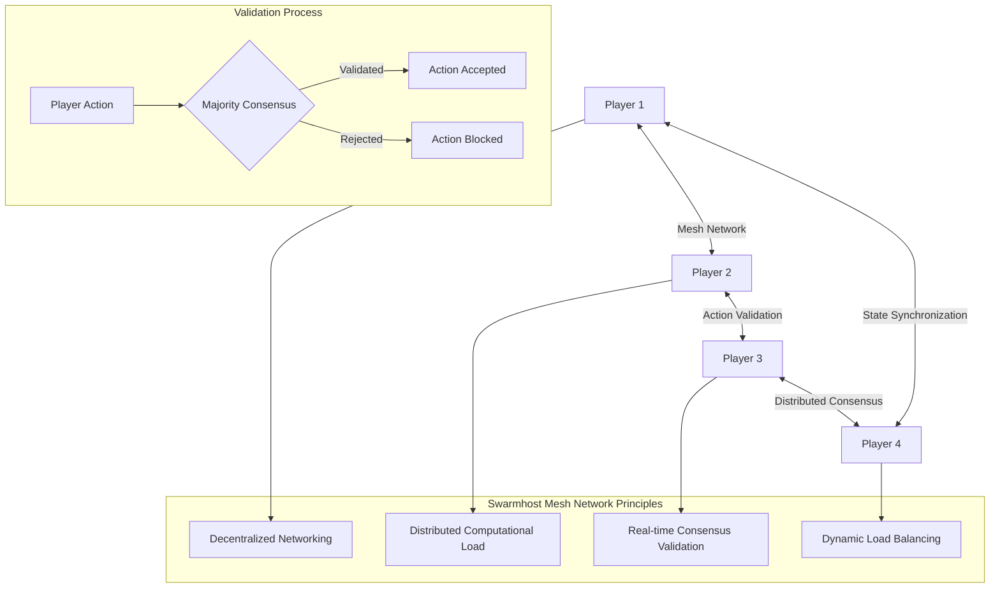
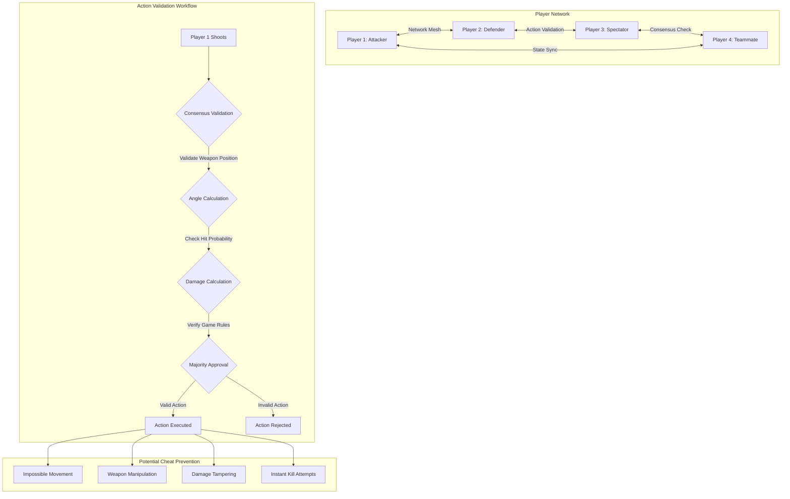

# swarmhost-core
Evolution of multiplayer game hosting - distributed, secure, and scalable

```mermaid
flowchart TD
    A[Player 1] <-->|Mesh Network| B[Player 2]
    B <-->|Action Validation| C[Player 3]
    C <-->|Distributed Consensus| D[Player 4]
    D <-->|State Synchronization| A

    subgraph "Swarmhost Mesh Network Principles"
    direction TB
    V1[Decentralized Networking]
    V2[Distributed Computational Load]
    V3[Real-time Consensus Validation]
    V4[Dynamic Load Balancing]
    end

    subgraph "Validation Process"
    direction LR
    VA[Player Action] --> VB{Majority Consensus}
    VB -->|Validated| VC[Action Accepted]
    VB -->|Rejected| VD[Action Blocked]
    end

    A --> V1
    B --> V2
    C --> V3
    D --> V4
```

```mermaid
flowchart TD
    subgraph "Player Network"
    P1[Player 1: Attacker] <-->|Network Mesh| P2[Player 2: Defender]
    P2 <-->|Action Validation| P3[Player 3: Spectator]
    P3 <-->|Consensus Check| P4[Player 4: Teammate]
    P4 <-->|State Sync| P1
    end

    subgraph "Action Validation Workflow"
    A1[Player 1 Shoots] --> A2{Consensus Validation}
    A2 -->|Validate Weapon Position| A3{Angle Calculation}
    A3 -->|Check Hit Probability| A4{Damage Calculation}
    A4 -->|Verify Game Rules| A5{Majority Approval}
    A5 -->|Valid Action| A6[Action Executed]
    A5 -->|Invalid Action| A7[Action Rejected]
    end

    subgraph "Potential Cheat Prevention"
    C1[Impossible Movement]
    C2[Weapon Manipulation]
    C3[Damage Tampering]
    C4[Instant Kill Attempts]
    end

    A6 --> C1
    A6 --> C2
    A6 --> C3
    A6 --> C4
```
